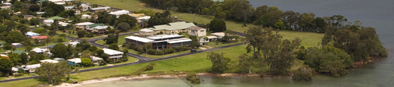
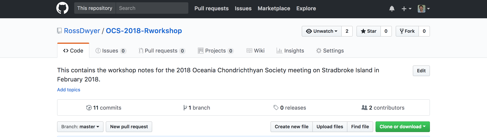
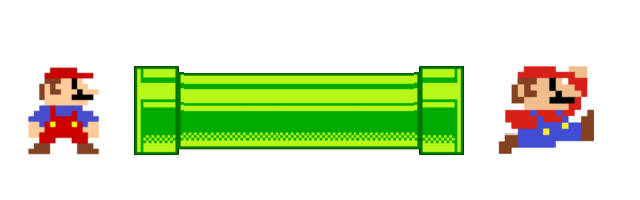
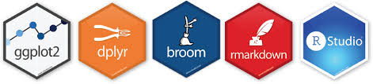
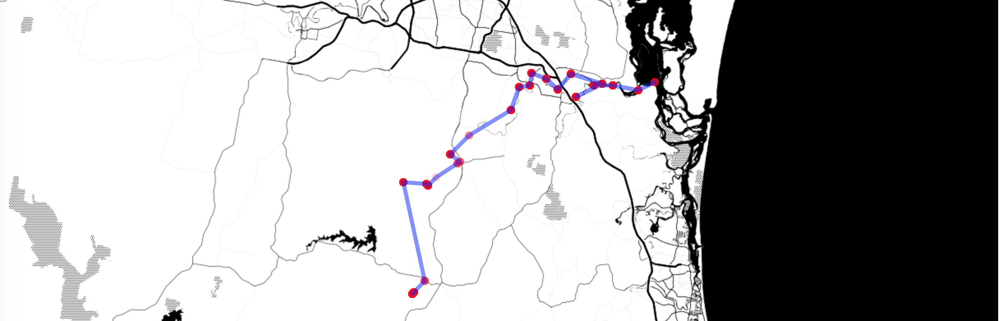
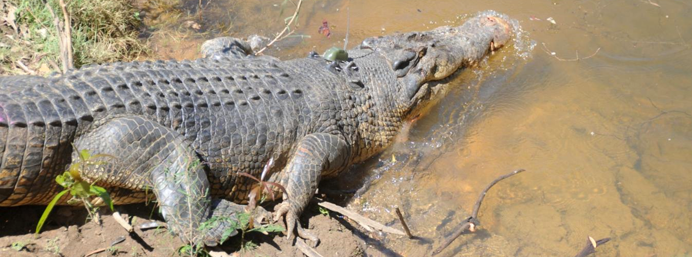
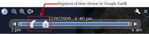
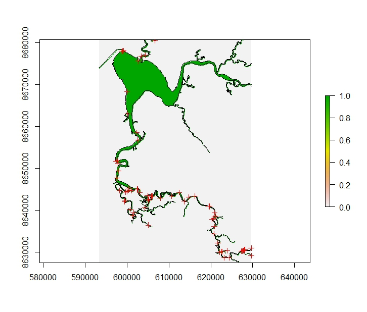
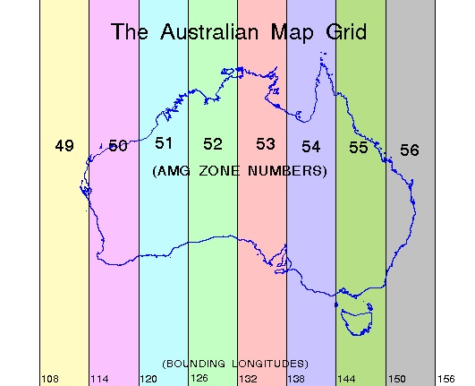
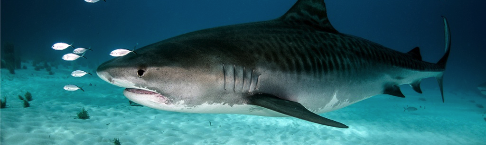

<br>  
<br> 

--------------------------------------

--------------------------------------

# Introductions

## Who are we?

Ross is a Postdoctoral Research Fellow in the [School of Biological Sciences](https://www.biology.uq.edu.au/) at the University of Queensland. His research falls within the field of animal ecology, where he uses animal occurrence, abundance and movement information to test hypotheses and make predictions regarding individual- and population-level responses to environmental change. He's used R for over 12 years, has published two R packages on CRAN, was lead R developer on the ZoaTrack.org project and regularly teaches R training courses at The University of Queensland and at other institutes around Australia. For more information and teaching resources, check out [Ross's website](https://www.uq.edu.au/eco-lab/content/dr-ross-dwyer).

Vinay is an Postdoctoral Research Fellow at the [Australian Institute of Marine Science](https://www.aims.gov.au/). He is an ecologist that is particularly interested in using large spatio-temporal datasets to understand animal movements and distributions patterns. He has considerable experience using R to analyse and visualise large and complex spatial datasets. He has developed R code to analyse 2 and 3 dimentional movement patterns of animals using acoustic telemetry data from single study sites to continental scale arrays. Vinay's R codes can be found on his [github page](https://github.com/vinayudyawer)


## Course outline

**In this course you will learn how to analyse and interpret your aquatic telemetry datasets in R**. This workshop will hopefully show you how **R** can make the processing of spatial data much quicker and easier than using standard GIS software, and can help you plot some *deadly* figures! At the end of this workshop you will also have the annotated **R** code that you can re-run at any time, share with collaborators and build on with those newly acquired data!

We designed this course not to comprehensively cover all the tools in **R**, but rather to teach you skills for taking your experience with R to the next level. Every new project comes with its own problems and questions and you will need to be independent, patient and creative to solve these challenges. It makes sense to invest time in becoming familiar with **R**, because today **R** is the leading platform for environmental data analysis and has some other functionalities which may surprise you! 

<br>

This R workshop will be divided into 4 sessions intended to run about 1 hr 15 mins each.

* Session 1: *Data wrangling*
0.  A brief introduction to **R**
1.  **Import** large telemetry datasets into **R** using [data.table](https://cran.r-project.org/web/packages/data.table/vignettes/datatable-intro.html)
2.  **Filter** and **manipulate** our data using %pipes% and the [tidyverse](http://tidyverse.org/) group of **R** packages
3.  **Plot** summary statistics using [ggplot2](http://ggplot2.org/)

* Session 2: *Working with spatial objects*
4.  Working with **Spatial* objects**
5.  Generating interactive maps using [leaflet](http://leafletjs.com/) 

* Session 3: *Assessing temporal components of tracking datasets*
6.  Producing track **animations** 
7.  Integration with [Google Earth](http://googleearth.com/) 
8.  Calculating **distance metrics** (direct, circuitous, least cost)
9.  Plotting distance travelled through time

* Session 4: *Calculating home ranges*
10. Calculating short-term centers of activity (**COA**)
11. Calculating and plotting **home range** area metrics using
    + MCPs (array/matrix)
    + Kernel distributions
    + Brownian bridges
12.  **ESRI Shapefile** import and export

<br>
<br>

**The main principles we hope you will learn today are...**

* Data wrangling in **R** is safe, fast, reliable and repeatable
* **R** can easily handle large datasets
* **R** is the ideal suite for performing your GIS operations
* that in **R**, it is easy to produce amazing publication-ready images 

<br>
<br>

---------------------------------------

--------------------------------------

# Session 1: Data wrangling

## A brief introduction to **R**

The process of turning raw telemetry data into publishable results is a highly involved process. Tracking data sets are becoming larger, and larger as they are being gathered over longer time periods, over larger spatial extents and at increasing temporal resolutions. While this is increasing our ability to detect subtle patterns, these data sets are becoming vast and require analytical tools that easily handle, manipulate and visualise these complex datasets.

Processing and analysing telemetry datasets can require a huge investment in time: rearranging data, removing erroneous values, purchasing, downloading and learning the new software, and running analyses. Furthermore merging together excel spreadsheets, filtering data and preparing data for statistical analyses and plotting in different software packages can introduce all sorts of errors. 

*There is a better way...*

**R** is a powerful language for data wrangling and analysis because...

1. It is relatively **fast** to run and process commands
2. You can create **repeatable** scripts
3. You can **trace errors** back to their source
4. You can **share your scripts** with other people
5. It is **easy to identify errors** in large data sets
6. Having your data in **R** opens up a huge array of **cutting edge analysis tools**.
7. **R** is also totally **FREE!** 

As **R** is open source, the more people we can get helping out on the **R** spatial mailing lists (e.g. **R-sig-geo**) and contributing their own spatial packages to the wider community, the more powerful **R** becomes!

**For this course, we assume you have a basic understanding of the *R* environment, and working with *RStudio*. If you do not have experience working in *R* we encourage you to go through [this online course](https://www.uq.edu.au/eco-lab/gpem-r-course) that will bring you up to speed!**

## Course resources

To access data and scripts we will work through in this course, download the **OCS-2018-Rworkshop** folder from [GitHub](https://github.com/RossDwyer/OCS-2018-Rworkshop). This folder contains the course documents, telemetry data and R scripts we are going to work with. To download the folder click on the green "Clone or download" dropdown menu and select "Download ZIP"





Once downloaded, the workshop folder contains the following sub folders:

1.  Documents
2.  Data
3.  R Code
4.  GIS


First unzip this folder and extract the folder to a location on your computer that you typically store your research files. 

To link with these folders, we are going to use the `Project` functionality of R Studio.

First, open the R Studio program on your computer and in the TOP LEFT corner of the R Studio window, click *File > New Project...*.

Next, create a New Project using the *Create Project* command (available on the Projects menu and on the global toolbar):


Select *Existing Directory* then save the project within the "OCS-2018-Rworkshop" folder. 

When a *New Project* is created, R Studio:

1.  Creates a project file (with an **.Rproj** extension) within the project directory. This file contains various project options (discussed below) and can also be used as a shortcut for opening the project directly from the file system.
2.  Creates a hidden directory (named **.Rproj.user**) where project-specific temporary files (e.g. auto-saved source documents, window-state, etc.) are stored. 
3.  Loads the project into R Studio and display its name in the Projects toolbar (which is located on the far right side of the main toolbar (very TOP RIGHT of the R Studio window).

## Why Projects are awesome

There are a number of good reasons why you should work with Projects in RStudio.
1.  We may want our R scripts to be saved into a place where they link seamlessly to other documents and data files for our research project.
2.  We may also want our tables, figures and statistical results to be written to locations on our computer where they are easy to locate.
3.  We may work on multiple workstations (desktops, laptops) that we want our code to be completely transferable using cloud infrastructure (e.g. [Dropbox](http://www.dropbox.com/), [OneDrive](https://onedrive.live.com/about/en-au/))
4.  It allows it to share work folders, data and R code with collaborators who are working on the same projects

## Installing packages

Part of the reason R has become so popular is the vast array of packages that are freely available and highly accessible. In the last few years, the number of packages has grown exponentially [> 10,000 at my last check on CRAN!](http://blog.revolutionanalytics.com/2017/01/cran-10000.html) These can help you to do a galaxy of different things in R, including running complex analyses, drawing beautiful figures, running R as a GIS, constructing your own R packages, building web pages and even writing introductory R course handbooks!

Let’s suppose you want to load the *sp* package to access this package's incredible spatial functionality. If this package is not already installed on your machine, you can download it from the web by using the following command in R.

```{r, include=TRUE, eval=FALSE}
install.packages("sp", repos='http://cran.us.r-project.org')
```

In this example, `sp` is the package to be downloaded and 'http://cran.us.r-project.org' is the repository where the package will be accessed from. 

Multiple packages can be loaded at the same time by listing the required packages in a vector... 

``` {r, include=TRUE, eval=FALSE}
install.packages(c("rgdal","rgeos","adehabitatHR",
                   "raster","gdistance",
                   "leaflet","tidyverse",
                   'XML', 'gstat', 'Hmisc', 'checkmate',"devtools"), repos='http://cran.us.r-project.org')
```

We then load the required packages from our computer's R package library using the `library()` function.

```{r, echo=FALSE, message=FALSE, warning=FALSE}
library(sp)
library(rgdal)
library(rgeos)
library(adehabitatLT)
library(adehabitatHR)
library(leaflet)
library(tidyverse)
library(devtools)
```

<br>  
<br> 

----------------------------

----------------------------
##  Importing large telemetry datasets into **R**

```{r, echo=FALSE,message=FALSE,include=TRUE}

library(leaflet)
library(sp) 
library(knitr)

## Import datasets
blacktip <- read.csv('Data/Blacktip_ClevelandBay.csv')
statinfo <- read.csv('Data/Station_information.csv')
cb<-statinfo[statinfo$Installation%in%"Cleveland Bay",]

coordinates(blacktip) <- ~Longitude+Latitude
b1 <- remove.duplicates(blacktip[blacktip$Transmitter.Name%in%levels(blacktip$Transmitter.Name)[1],])
b2 <- remove.duplicates(blacktip[blacktip$Transmitter.Name%in%levels(blacktip$Transmitter.Name)[2],])
b3 <- remove.duplicates(blacktip[blacktip$Transmitter.Name%in%levels(blacktip$Transmitter.Name)[3],])

leaflet() %>%
  
  #Base groups
  #addProviderTiles(providers$OpenStreetMap,group = "Map") %>%  # Add default OpenStreetMap map tiles
  addProviderTiles(providers$Esri.WorldImagery, group="Satellite") %>%
  
  #Add recievers and detection data
  addCircles(lng=cb$Longitude, lat=cb$Latitude,fill=FALSE, color="gray", weight=8) %>%
  addCircles(lng=cb$Longitude, lat=cb$Latitude,fill=FALSE, color="gray", weight=8, group = levels(blacktip$Transmitter.Name)[1]) %>%
  addCircleMarkers(lng=b1$Longitude, lat= b1$Latitude, popup=paste("ID = ",blacktip$Transmitter),
                   weight=2,radius=4,color = "red",
                   stroke = FALSE, fillOpacity = 0.4, group = levels(blacktip$Transmitter.Name)[1]) %>%
  addCircles(lng=cb$Longitude, lat=cb$Latitude,fill=FALSE, color="gray", weight=8, group = levels(blacktip$Transmitter.Name)[2]) %>%
  addCircleMarkers(lng=b2$Longitude, lat= b2$Latitude, popup=paste("ID = ",blacktip$Transmitter),
                   weight=2,radius=4,color = "green",
                   stroke = FALSE, fillOpacity = 0.4, group = levels(blacktip$Transmitter.Name)[2]) %>%
  addCircles(lng=cb$Longitude, lat=cb$Latitude,fill=FALSE, color="gray", weight=8, group = levels(blacktip$Transmitter.Name)[3]) %>%
  addCircleMarkers(lng=b3$Longitude, lat= b3$Latitude, popup=paste("ID = ",blacktip$Transmitter),
                   weight=2,radius=4,color = "blue",
                   stroke = FALSE, fillOpacity = 0.4, group = levels(blacktip$Transmitter.Name)[3]) %>%

  #Layers control
  addLayersControl(
    #baseGroups = c("Map","Satellite"),
    baseGroups = levels(blacktip$Transmitter.Name),
    options = layersControlOptions(collapsed = FALSE)) %>%

  
  hideGroup(levels(blacktip$Transmitter.Name))

```

The web map of detection data we will explore by the end of **Session 1**

In the first session we are going to work with a data set containing detection data from 3 Australian Blacktip Sharks (*Carcharhinus tilstoni*) shown in the image above. These animals were captured and tagged within Cleveland Bay, Townsville roughly one month prior to the landfall of Cyclone Yasi in 2011. Blacktip sharks were tracked using a network of acoustic hydrophones deployed in a grid pattern on the East and West side of Cleveland Bay.

Before we can analyse these data, we first need to read this dataset into R. As with most acoustic detection datasets exported from VUE or other acoustic telemetry data management software, our data set is in the 'comma sperated value' (.csv) format. 

A .csv file can simply be imported into **R** using the `read.csv` base function, and by telling R which file to load (`Blacktip_ClevelandBay.csv`) and where to find it (i.e. in the `Data` folder).

```{r}
# Load the blacktip shark data using base read.csv function
blacktip <- read.csv('Data/Blacktip_ClevelandBay.csv', header = TRUE)
```

However, loading very large datafiles can take a long time when using the `read.csv` function. A useful alternative is the `fread` function in the 'data.table' package, which is very effective at loading very large files such as those exported from the [Vemco VUE database](https://vemco.com/products/vue-software/).

```{r, message=FALSE}
library(data.table)
# Load the blacktip shark data using data.table
blacktip <- fread('Data/Blacktip_ClevelandBay.csv', header = TRUE)

## You can also use fread to input data directly from a website URL
blacktip <- fread('https://raw.githubusercontent.com/RossDwyer/OCS-2018-Rworkshop/master/Data/Blacktip_ClevelandBay.csv')
```

**A note about Excel files**  

Don’t use '.xlsx' or '.xls' files for saving data. The problem with '.xls' and '.xlsx' files are that they store extra info with the data that makes files larger than necessary and Excel formats can also unwittingly reformat or alter your data! 

A stable way to save your data is as a '.csv' file, which stands for 'comma separated values'. These are simply values separated by 'commas' and rows defined by 'returns'. If you select 'Save as’ in excel, you can choose '.csv' as one of the options. If you open the .csv file provided in the `Data` folder using a text editor, you will see it is just words, numbers and commas.

## **Filtering** and **manipulating** datasets

The ability to quickly filter and manipulate datasets datasets is important when working with large telemetry datasets. The standard input format of tabulated data in R is a `data.frame`. A data.frame is a special ‘class’ of an object, where there are multiple variables, stored in named columns and multiple rows for our detections. Every variable has the same number of columns. There are simple rules to filter and select data from a data.frame. Rows and columns are indexed by using a comma as a separator `df[row,column]`. Try the following code:

```{r,eval=FALSE}
blacktip[1,] # Provides the first row of data
blacktip[1,3] # Provides the cell value from the 1st row and 3rd column
blacktip[,3]  # Provides the first column of data
blacktip[c(1,3),] # Provides the first and third date in the data frame
```

We can also access objects in a data.frame by their names:

```{r,eval=FALSE}
blacktip$Transmitter #provides all the data for that object
blacktip$Transmitter[1:5] #provides athe first five values for that object
blacktip[,'Transmitter'] #provides all the data for that object
```

The `data.table` package enhances the functionality of the traditional data.frame format and allows you to do more than just select data based on row and column names.

Firstly, data loaded using the `fread` function inputs detection data as a data.table format. This format is slightly different to the data.frame format but can still be maniuplated using the same rules as above. 

To understand the enhancements of the data.table format we must first understand the general form of the data.table syntax. data.tables take the form of `DT[row, column, by]`. The additional `by` variable allows for quick and easy subsetting and aggregating. Try the following code:

```{r,eval=FALSE}
## Subset rows within a data.table
blacktip[`Transmitter Name` == "Ana" & Receiver == "VR2W-104912",] # Select detections from 'Ana' detected on "VR2W-104912" receiver.

## Subset rows and columns within a data.table
blacktip[`Transmitter Name` == "Ana", .(Receiver, Latitude, Longitude),] # Subsets Receiver, Latitude and Longitude data from `Ana`

## Aggregate numbers of detections from each of the three tagged animal
blacktip[ , .(.N), by = "Transmitter Name"]
```

The `.N` call is a special variable that holds the number of rows in that current group. Grouping by `Transmitter Name` obtains the number of rows (i.e. detections) for each shark. We can include multiple variables in the `by` parameter to subset our datset further:

```{r, eval=FALSE}
## Aggregate numbers of detections at each reciever for each tagged animal
blacktip[ , .(.N), by = c("Transmitter Name", "Receiver")]
```

We encourage you to use the package vignettes to explore additional functionality of the `data.table` package to make data subsetting and manipulation quicker and easier.

```{r, eval=FALSE}
browseVignettes("data.table")
```

### Pipes `%>%`



Now that we've successfully loaded in our tracking dataset, lets start having a closer look at the data using pipes `%>%`

* Originally from the `magrittr` package but has been imported to the `tidyverse`.
* `%>%` is an **infix operator**. This means it takes two operands, left and right.
* 'Pipes' the **output** of the last expression/function (left) forward to the **first input** of the next funciton (right).

```{r, eval = FALSE}
#For example, to see what class our data is in, we could use this code...
class(blacktip)

#Alternatively in the tidy verse we could use this code...
blacktip %>% class()
```

#### Benefits of pipes %>% 
* Functions flow in natural order that tells story about data.
* Code effects are easy to reason about by inserting `View()` or `head()` into pipe chain.
* Common style makes it easy to understand collaborator (or your own) code.

We can have a quick look at the data by typing:

```{r, eval = FALSE}
# Now insert functions into the pipe chain
blacktip %>% View()
blacktip %>% head() #first 6 rows by default
blacktip %>% tail(10) #specify we want to look at the last 10 rows
```

This functionality is particularly useful if the data is very large!

Note the `()` around the data frame, as opposed to the `[]` we used for indexing. The `()` signify a *function*.

We can look at the data more closely using the `nrow`, `ncol`, `length`, `unique`, `str()` and `summary()` functions.

```{r, eval=FALSE}
blacktip %>% nrow() # number of rows in the data frame
blacktip %>% ncol() # number of columns in the data frame
blacktip %>% str() # provides internal structure of an R object
blacktip %>% summary() # Provides result summary of the data frame
```
```{r, eval=TRUE}
## pipes can be used for single column within data frames
blacktip$`Transmitter Name`<-
  blacktip$`Transmitter Name` %>% as.factor()

## pipes are used to conduct multiple functions on the dataset in a certain order
blacktip %>% 
  subset(`Transmitter Name` == "Colin") %>% # subset dataset to include only detections by 'Colin'
  nrow() # number of rows (i.e. detections) from 'Colin'
```

Pipes can also be used to pre-process our data before plotting them. Lets now use pipes to plot a simple barplot of the number of Colins detections at each reciever.

```{r, eval=TRUE}
blacktip %>% 
  subset(`Transmitter Name` == "Colin") %>% # subset dataset to include only detections by 'Colin'
  with(table(`Station Name`)) %>% # Create a table with the number of rows (i.e. detections) per receiver
  barplot(las=2) # barplot of number of Colins detections recorded per receiver
```

## The *tidyverse*



Now that you've fully jumped into the world of pipes, it's time to fully introduce you to the *tidyverse* group of R packages. These have really revolutionised the way we work with big data and the way we visualise our results.

```{r setup, include=FALSE}
library(tidyverse)
```

### What is the tidyverse?
* The [tidyverse](http://tidyverse.org/) is the collective name given to suite of **R** packages designed mostly by Hadley Wickham.
* Before it was formalised in 2016 it was loosely referred to as the `hadleyverse`.
* Packages share a common API and design philosophy intended to create a **"Pit of Success"**.
* The documentation of this style is still evolving.
* This is a good [start](https://rpubs.com/yeedle/tidyguide)

#### Members of the tidyverse
broom, **dplyr**, forcats, **ggplot2**, haven, httr, hms, jsonlite, **lubridate**, magrittr, modelr, purrr, **readr**, readxl, stringr, tibble, rvest, **tidyr**, xml2

##### `lubridate`
* `lubridate` is an easy way to convert date time data into a form R can recognise it.
* Allows for calculation of durations and intervals between dates.
* This package recognises multiple date time formats and parses them to a standardised 'POSIX' format that R uses (`ymd` for dates; `ymd_hms` for date and time parsing)
* essential when working with spatio-temporal datasets like telemetry data

Currently in our `blacktip` dataset the "Date and Time (UTC)" column is recognised as "characters" and recorded in the Universal Coordinated Time Zone (UTC). We want to convert this to local time (UTC + 10 hours). Lets use `lubridate` to convert this column into the 'POSIX' format and into local date time.

```{r, eval=TRUE}
library(lubridate)
blacktip$local.Date.time<- 
  blacktip$`Date and Time (UTC)` %>%
  ymd_hms(tz="UTC") %>% ## first convert the `Date and Time (UTC)` column into a 'POSIX' format 
  with_tz(tzone="Australia/Brisbane") ## convert to local "Australia/Brisbane" date time (UTC + 10hrs)
```


##### `dplyr`
* `dplyr` is the data wrangling workhorse of the tidyverse.
* Provides functions, **verbs**, that can manipulate tibbles into the shape you need for analysis.
* Has many backends allowing dplyr code to work on data stored in SQL databases and big data clusters.
    - Works via translation to SQL. Keep an eye out for the SQL flavour in `dplyr`

**Basic vocabulary**
* `select()` columns from a tibble 
* `filter()` to rows matching a certain condition
* `mutate()` a tibble by changing or adding rows
* `arrange()` rows in order
* `group_by()` a variable
* `summarise()` data over a group using a function

Check out this useful [Cheatsheet](https://www.rstudio.com/wp-content/uploads/2015/02/data-wrangling-cheatsheet.pdf) for data wrangling.

##### `select`

We can use the `select` function in dplyr to choose the columns we want to include for our analyses and plotting

```{r}
# Select the rows we are interested in
blacktip <- 
  blacktip %>% 
  select(`local.Date.time`,`Latitude`,`Longitude`,`Receiver`,`Station Name`,`Transmitter Name`,`Transmitter`,`Sensor Value`) %>%
  select(-`Sensor Value`)

head(blacktip)
```

##### `filter` and `arrange`
Subset the data to rows matching logical conditions and then arrange according to particular attributes
```{r, eval=FALSE}
filter(blacktip, `Transmitter Name` == "Ana") %>%
  arrange(local.Date.time) ## arrange Ana's detections in chronological order

filter(blacktip, `Transmitter Name` == "Bruce") %>%
  arrange(desc(local.Date.time)) ## arrange Bruce's detections in descending chronological order
```


##### `summarise`
Determine the total number of detections for each tagged shark
```{r, eval=FALSE}
blacktip %>%
  group_by(`Transmitter Name`) %>%
  summarise(NumDetections = n()) ## summarise number of detections per tagged shark

blacktip %>%
  group_by(`Transmitter Name`, `Receiver`) %>%
  summarise(NumDetections = n()) ## summarise number of detections per shark at each receiver
```

##### `mutate`
Adding and removing data to the data frame through a pipe
```{r}
blacktip<-
  blacktip %>%
  mutate(date=date(local.Date.time)) %>% ## adding a column to the blacktip data with date of each detection
  mutate(Transmitter=NULL) ## removing the `Transmitter` column

head(blacktip)
```

## Data visualisation using `ggplot2`

ggplot2 is a powerful data visualization package for the R programming language. The package makes it very easy to generate some very impressive figures and utilise a range of colour palettes, taking care of many of the fiddly details that can make plotting graphs in R a hassle.

The system provides **mappings** from your data to **aesthetics** which are used to construct beautiful plots.

Documentation for ggplot can be found [here](http://ggplot2.org/) and [here](http://docs.ggplot2.org/current/index.html).

There is also this awesome [Cheetsheet](https://www.rstudio.com/wp-content/uploads/2015/03/ggplot2-cheatsheet.pdf) for ggplot2

### `ggplot2` grammar
The basic idea: independently specify plot building blocks and combine them to create just about any kind of graphical display you want. Building blocks of a graph include:
* data
* aesthetic mapping
* geometric object
* statistical transformations
* scales
* coordinate system
* position adjustments
* faceting

In the below script we call the data set we have just made (`blacktip`) and then pipe it into the ggplot function. We than tell ggplot that we want to plot a box plot

```{r}
library(ggplot2)   

blacktip %>%
  group_by(`Transmitter Name`,`date`) %>% 
  summarise(DailyDetections= n()) %>% ## use summarise to calculate numbers of detections per day per animal
  ggplot(mapping = aes(x = `Transmitter Name`, y = DailyDetections)) + ## define the aesthetic map (what to plot)
  geom_boxplot() ## define the geometric object (how to plot it).. in this case a boxplot

```

A common plot used in passive acoustic telemetry to assess temporal patterns in detection is the `Abacus plot`. This plot can help quickly assess which animals are being detected consistently within your array, and identify any temporal patterns in detection.

We can adapt the above script to create an abacus plot using our `blacktip` dataset

```{r}
blacktip %>%
  ggplot(mapping = aes(x = `local.Date.time`, y = as.factor(`Transmitter Name`))) + 
  xlab("Date") + ylab("Tag") +
  geom_point()
```

We can also use the `facet_wrap` function to explore the detection data a bit more and look at how animals were detected at each reciever

```{r}
blacktip %>%
  ggplot(mapping = aes(x = `local.Date.time`, y = as.factor(`Station Name`))) + 
  xlab("Date") + ylab("Receiver station") +
  geom_point() +
  facet_wrap(~`Transmitter Name`, nrow=1) ## This time plot seperate boxplots for each shark
```

#### Aesthetic Mapping
In ggplot, aesthetic means “something you can see”. Aesthetic mapping (i.e., with aes()) only says that a variable should be mapped to an aesthetic. 
It doesn’t say how that should happen. For example, when mapping a variable to shape with aes(shape = x) you don’t say what shapes should be used. 
Similarly, aes(color = z) doesn’t say what colors should be used. Describing what colors/shapes/sizes etc. to use is done by modifying the corresponding scale. 

In ggplot2 scales include:

* position (i.e., on the x and y axes)
* color (“outside” color)
* fill (“inside” color)
* shape (of points)
* linetype
* size

Each type of geom accepts only a subset of all aesthetics–refer to the geom help pages to see what mappings each geom accepts. Aesthetic mappings are set with the aes() function.

#### Geometic Objects (geom)
Geometric objects are the actual marks we put on a plot. Examples include:

* points (geom_point, for scatter plots, dot plots, etc)
* lines (geom_line, for time series, trend lines, etc)
* boxplot (geom_boxplot, for, well, boxplots!)
A plot must have at least one geom; there is no upper limit. You can add a geom to a plot using the + operator

You can get a list of available geometric objects using the code below:

```{r, eval = FALSE}
help.search("geom_", package = "ggplot2")
```

<br>  
<br> 

----------------------------

----------------------------

# Session 2: Working with spatial objects

R offers a variety of functions for importing, manipulating, analysing and exporting spatial data. Although one might at first consider this to be the exclusive domain of GIS software, using R can frequently provide a much more lightweight, yet equally effective solution that embeds within a larger analytic workflow.

One of the tricky aspects of pulling spatial data into your analytic workflow is that there are numerous complicated data formats. In fact, even within R itself, functions from different user-contributed packages often require the data to be structured in very different ways. The good news is that efforts are underway to standardize spatial data classes in R. This movement is facilitated by sp, an important base package for spatial operations in R. It provides definitions for basic spatial classes (points, lines, polygons, pixels, and grids) in an attempt to unify the way R packages represent and manage these sorts of data. It also includes some core functions for creating and manipulating these data structures. The hope is that all spatial R packages will use (or at least provide conversions to) the 'Spatial' data class and it's derivatives, as now defined in the sp package. All else being equal, we favor R functions and packages that conform to the sp standard, as these are likely to provide the greatest future utility and durability.

[Here](http://www.maths.lancs.ac.uk/~rowlings/Teaching/UseR2012/cheatsheet.html) is a very useful style guide for coding using `Spatial` objects.

---------------------------

## `SpatialPoints` and receiver locations

The most basic spatial data object is a point, which may have 2 (X, Y) or 3 components (X, Y, Z). A single coordinate, or a collection of coordinates, may be used to define a `SpatialPoints` object.

In this exercise we are going to convert our receiver locations from a standard data frame object into a `SpatialPointsDataFrame` object.

```{r,echo=FALSE}
# First load our VR2-W installation dataset for the Cleveland Bay study
statinfo <- read.csv('Data/Station_information.csv')
cb <- statinfo[statinfo$Installation%in%"Cleveland Bay",]

# Now convert the data.frame object into a SpatialPoints object
coordinates(cb) <- c("Longitude", "Latitude")

## Have a look at the created object
class(cb)
str(cb)
```

Notice the class has now become a `SpatialPointsDataFrame`. The `str()` output contains lots of `@` symbols which denote a different slot in this S4 R object. Typing `cb@data` will extract the attribute data (similar to the attribute table in ArcGIS). The X and Y locational information can now be found in the `@coords` slot. In addition `@bbox` contains the bounding box coordinates and the `@pro4string` contains the projection, or coordinate reference system (CRS) information. 

```{r, eval=FALSE}
cb@coords
cb@proj4string
cb@bbox
head(cb@data)

# alternatively use the slot command to extract different 
# packages of data. As the data is stored in the data slot
slot(cb,'data') 
```

Now let’s draw a simple spatial plot of the receiver locations

```{r}
# Now create a plot for the receiver stations
data.frame(cb) %>%
  ggplot(mapping = aes(x = Longitude, y = Latitude)) + 
  xlab("Longitude") + ylab("Latitude") +
  geom_point()
  
```

## Interactive maps using `leaflet`

Now that we have allocated our data as a Spatial* object, we can also use the incredibly powerful [Leaflet](https://rstudio.github.io/leaflet/) package in R to plot the locations of our hydrophones on an interactive map that  you can share with your collaborators. The leaflet package utilises the open-access leaflet JavaScript library (a web programming language), to create web-based maps. We will cover a basic map with some points on it today. See [Rstudio’s leaflet page](http://rstudio.github.io/leaflet/) for help and more mapping features, like polygons.

To get started with leaflet, first, make sure you have the `leaflet` and `htmlwidgets` packages installed, and then load it into this session:

```{r}
library(leaflet)
library(htmlwidgets)
```

We start by specifying a base layer, then we can add features to it. We will string together our layers using the pipes (`%>%`) command. See [this page](http://rstudio.github.io/leaflet/basemaps.html) for the numerous base map options. Finally, we add some markers, located using the longitude and latitude variables in the blacktip data frame:


```{r}
library(leaflet)

myleafletplot <- leaflet() %>%
  
  #Base groups (you can add multiple basemaps)
  addProviderTiles(providers$Esri.WorldImagery, group="Satellite") %>%
  addProviderTiles(providers$OpenStreetMap, group="Map") %>%
  
  #Add reciever location data
  addCircles(lng=cb$Longitude, lat=cb$Latitude, fill=FALSE, color="gray", weight=8) 

myleafletplot # Print the map

```

We can also now add the detection data from our tagged sharks to show their positions within the array. 

```{r}
## First lets convert our blacktip data into a spatial points data frame object
blacktip <- read.csv('Data/Blacktip_ClevelandBay.csv', header = TRUE)
coordinates(blacktip)<-c("Longitude","Latitude")

## Subset detection data from "Ana" and remove duplicate positions
ana <-
  blacktip %>%
  subset(`Transmitter.Name` == "Ana") %>%
  remove.duplicates() ## remove duplicated positions to reduce the number of points to plot on our leaflet map
```

Now lets add Ana's detection data to our leaflet map

```{r}
myleafletplot %>%
  
  # add the tag detection data
  addCircleMarkers(lng=ana$Longitude, lat=ana$Latitude, weight=2,radius=4,color = "red",
                   stroke = FALSE, fillOpacity = 1, group = "Ana") %>% ## Dont forget to assign a group to the markers
  
  #Layers control
  addLayersControl(
    baseGroups= c("Satellite","Map"),
    overlayGroups = c("Ana"), ## add the groups you want to overlay on the base maps
    options = layersControlOptions(collapsed = FALSE))

## Now try adding detection data from "Colin" and "Bruce" to the map
```

Finally, you can save this leaflet document at an html file and share it with your friends or colleagues


```{r, eval = FALSE}
library(htmlwidgets)
saveWidget(myleafletplot, file="mymap.html") # uses the htmlwidgets package
```

<br>  
<br> 

-------------------------------------

-------------------------------------

# Session 3: Accessing the temporal component of tracking datasets

In this third session we are going to work with a data set containing detection data from 3 Estuarine Crocodiles (*Crocodylus porosus*) as shown in the image above. These animals were captured and tagged within the Wenlock River, Cape York. Crocodiles were dual tagged using both GPS transmitters and using a network of acoustic hydrophones deployed along the river system. You can read more about this study [here]<http://www.publish.csiro.au/mf/mf14042>

## Producing track **animations**

Vinay to add...

## Integration with [Google Earth](http://googleearth.com/)

Google Earth offers a simple yet powerful way of visualising your acoustic tracking data through time. However Pulling detection datasets into Google earth can be challenging given the size of many detection files. The [VTrack](http://plotkml.r-forge.r-project.org/) R package has a few handy functions for visualising your tag detections as track animations in [Google Earth](https://www.google.com/earth/)). 

For this to work, your receiver locations MUST be in the datum WGS84 and you will need to have Google Earth downloaded on your machine. If you have not already got it, Google Earth can be downloaded for free [here]<https://www.google.com/earth/download/gep/agree.html>

For this workshop, we will need the most recent version of the VTrack R package from our GitHub repository. This contains some new functionality that currently is not on CRAN.

```{r}
library(devtools) # Includes funct

install_github("RossDwyer/VTrack")
library(VTrack)

```

We will then load our tracking detection dataset into the VTrack format and extract a list of transmitters. 

```{r}

# Load crocodile datset into VTrack archive
data(crocs)
Vcrocs <- ReadInputData(infile=crocs,
                        iHoursToAdd=10,
                        dateformat = NULL,
                        sVemcoFormat='1.0')
Vcrocs %>% head()

# Load Wenlock points file
data(PointsDirect_crocs)
PointsDirect_crocs %>% head()
```

Once we have our dataset in the VTrack archive format and a seperate Points file containing the receiver locations, we can then run VTrack's KML creator functions. `GenerateAnimationKMLFile_Track()` generates a moving arrow for a single transmitter as it moves between the detection field of adjacent receiver stations. 

```{r, eval=FALSE}

levels(Vcrocs$TRANSMITTERID)

##NEED TO CHECK THIS WORKS

# Run the function to generate the KML for a single transmitter
GenerateAnimationKMLFile_Track(Vcrocs, # VTrack archive file
                               "139", # Transmitter code
                               PointsDirect_crocs, # points file
                               "Track1.kml", # file name
                               "cc69deb3", # colour of the track
                               sLocation="RECEIVERID")
```


The file will be written in your Project folder and can be opened in Google Earth. Users can adjust the time slider to visualise individual time periods for display or can click the spanner icon to slow down the speed of the animation.



There is also a another handy function for visualising the movements of multiple animals at a time.

```{r, eval=FALSE}
GenerateAnimationKMLFile_Multitag(Vcrocs,
                                  PointsDirect_crocs,
                                  "Croc Multi.kml",
                                  sLocation="RECEIVERID")
```

## Calculating **distance metrics** (direct, circuitous, least cost)

In this next exercise we will extract a metric to compare how far each of our tagged animals moved during the period of study. To do this, we use one of the `Generate*Distance()` functions within VTrack which calculates the distances between each of our hydrophone stations and assemble the distances within a matrix.

### Direct distance
If our receivers are in open water or in an enclosed bay or dam, there may be no obvious barriers to animal movement so we could use the `GenerateDirectDistance()` function to generate our distance matrix. 

```{r}
VR2ArrayDM <- GenerateDirectDistance(PointsDirect_crocs) 
VR2ArrayDM
```

### Circuitous distance
In, our crocodile example however, our animal's movements are bounded by the banks of the river and so cannot move directly (as the crow flies) between hydrophone stations. As a work around, the VTrack Package has a function `GenerateCircuitousDistance()` that calculates distances in series through a set of locations and waypoints to form an indirect path between receiver stations.

```{r}
# Load the points file
data(PointsCircuitous_crocs)

# Generate the Circuitous Distance Matrix
CircuitousDM <- GenerateCircuitousDistance(PointsCircuitous_crocs)

# Now plot example of how circuitous distances between receivers were generated
# In this example an individual must follow the course of the river in order to
#   move between receivers

PointsCircuitous_crocs %>% 
  ggplot(aes(x=LONGITUDE, y=LATITUDE)) +
  xlab("LONGITUDE") +
  ylab("LATITUDE") +
  geom_path() + 
  geom_point() +
  geom_point(data=PointsDirect_crocs, 
             aes(x=LONGITUDE, y=LATITUDE), color="red", size=3, shape=16) + # Plots the hydrophones in a different colour)
  geom_point(data=PointsDirect_crocs[1,], 
             aes(x=LONGITUDE, y=LATITUDE), color="green", size=3, shape=16) # Plots 103561 (i.e. the most downstream hydrophone) in a different colour)

```

We would then use this within the `RunResidenceExtraction()` function in VTrack to extract the movements between hydrophone stations and link this to our measure of distance travelled

```{r}
Res<- RunResidenceExtraction(Vcrocs,  
                             "STATIONNAME",    
                             2,              
                             60*60*12,
                             sDistanceMatrix=CircuitousDM)

# Our movements file
CrocMovements <- Res$nonresidences
```

### Least cost distance
Finally, many acoustic array designs will not fall in series like our above example and will insead be made up of multiple creeks and branches like this.



In this image the green area is the river and red crosses are the hydrophone locations. This function works by using a rasterised version of our study region (1 = water, 0 = land) then calculating the shortest (i.e. least cost) route transitioning from one cell to another to connect adjacent receiver stations. The function makes use of the [gdistance](https://cran.r-project.org/web/packages/gdistance/vignettes/gdistance1.pdf) R package and will work using any arrangement of acoustic arrays provided they are connected by water. 

First we load the raster layer of our study area using the raster R package and convert this to a transition object
```{r}
library(raster)
library(gdistance)

r5 <- raster("GIS/wenlock raster UTM.tif") # Load the raster
tr <- transition(r5, transitionFunction=mean, directions=8) # Create a Transition object from the raster
```

Next we load the tracking dataset and points file which uses a multi-branch array 

```{r, eval=FALSE}
library(VTrack)
barra <- read.csv('Data/barra.csv', header = TRUE)
barra[,1] <- as.POSIXct(barra[,1])

PointsLeastCost_crocs <- read.csv("Data/PointsLeastCost_crocs.csv")


#convert the raster to points for plotting
map.p <- rasterToPoints(r5)
df <- data.frame(map.p) #Make the points a dataframe for ggplot
colnames(df) <- c("X", "Y", "Water") #Make appropriate column headings

#Now plot the map
ggplot(data=df, aes(y=Y, x=X)) +
  geom_raster(aes(fill=Water)) +
  geom_point(data=POINTS3, 
             aes(x=X, y=Y), color="white", size=3, shape=16) +
  theme_bw() +
  coord_equal() 
```

Finally we run the `GenerateRasterDistance()` function in VTrack to generate the Distance matrix containing the Least cost paths.

```{r, eval=FALSE}
GenerateLeastCostDistance(sPointsFile = POINTS3,
                       sTransition = tr)
```

## Plotting distance travelled through time

Generating distance matrices can also be a useful way of extracting the distance of each receiver stations to a specific location (i.e. receiver positioned at the mouth of an estuary, instream structure or other point of interest). These distances can then be merged with the original detection dataset and plotted through time to look at associations and commonality in the timing of animal movements.

```{r, eval=FALSE}
DistDownstream <- CircuitousDM[,1:2] # i.e. distance from the the most downstream hydrophone - serial number 103561 
names(DistDownstream) <- c("RECEIVERID","Distance.DS")

Vcrocsm <- merge(Vcrocs,DistDownstream,by="RECEIVERID")
Vcrocsm <- Vcrocsm[order(Vcrocsm$TRANSMITTERID,Vcrocsm$DATETIME),]
row.names(Vcrocsm) <- NULL
Vcrocsm <- Vcrocsm[,c("DATETIME","TRANSMITTERID","SENSOR1","UNITS1","RECEIVERID","STATIONNAME","Distance.DS")]

Vcrocsm %>%
ggplot(aes(x=DATETIME, y=Distance.DS,group=TRANSMITTERID,colour=TRANSMITTERID)) +
  geom_line(alpha=0.5) +
  scale_y_continuous(name="Distance from most downstream receiver (km)")+
  xlab("Date") +
  theme_bw()+
  theme(legend.title = element_blank(),
        legend.position='none',
        axis.line = element_line(colour = "black"),
        panel.grid.major = element_blank(),
        panel.grid.minor = element_blank(),
        panel.border = element_blank(),
        panel.background = element_blank())
```

------------------------------------------

## Coordinate Reference Systems (CRS)

Central to working with spatial data, is that these data have a coordinate reference system (CRS class) associated with it. Geographical CRS are expressed in degrees and associated with an ellipse, a prime meridian and a datum. Projected CRS are expressed in a measure of length and a chosen position on the earth, as well as the underlying ellipse, prime meridian and datum.

Most countries have multiple coordinate reference systems, and where they meet there is usually a big mess — this led to the collection by the European Petroleum Survey Group (EPSG) of a geodetic parameter dataset.

The EPSG list among other sources is used in the workhorse PROJ.4 library, and handles transformation of spatial positions between different CRS. This library is interfaced with R in the rgdal package, and the CRS class is defined partly in the sp package and partly in rgdal.

In the next step, we need to define the CRS which corresponds to our dataset. For the cassowary GPS dataset (`cassdat.sp`), we have not specified the CRS so the `@pro4string` slot is empty at the moment (`= NA`). We therefore need to refer to the correct proj4 string information which is contained within the rgdal package.

Our receiver coordinates were collected in the **WGS 84** geographic datum in **Decimal Degrees**.

For simplicity, each projection can be referred to by a unique ID from the European Petroleum Survey Group (EPSG) geodetic parameter dataset. You can find the relevant EPSG code for your coordinate system from the website <http://spatialreference.org>. Here simply enter in a key word in the search box and select from the list the correct coordinate system. There is a map image in the top right of the site to help you. 

The equivalent EPSG code for WGS 84 is [**4326**](http://spatialreference.org/ref/epsg/4326/)

to set the spatial projection we use the `proj4string()` function

```{r, eval=FALSE}
WGS <- CRS("+init=epsg:4326")
proj4string(cassdat.sp) <- WGS
```

In order to calculate distances and areas correctly, we need to now transform our data to the correct spatial projection. 



From the above graphic, can you see which is the correct projection for the Townsville area - here's a [hint](http://spatialreference.org/ref/epsg/gda94-mga-zone-55/)

```{r, eval=FALSE}
GDA <- CRS("+init=epsg:28355") #The equivalent EPSG code for WGS 84 is 28355. 
cb.P <- spTransform(cb,GDA)
```

---------------------------------------

## Writing a shapefile object from **R**

Once you have the `Spatial` object the way you like it, you will want to export it to view in a GIS. Here we show you two options for exporting your `Spatial` object, as a **shapefile** or as a **.kml** for viewing in [Google Earth](https://www.google.com/earth/). As with reading in spatial objects, there are a number of **R** packages out there to help you. Simply type `??kml` or `??shapefile` to look up a few of these options.

In this example we are goint to use the `writeOGR()` function in the rgdal package. to write the data containing the movement metrics to a shapefile.

The `ld` function allows to quickly convert an object of class ltraj to a data.frame. We then reproject our data back to Longs and Lats (WGS 1984) for viewing in Arc GIS or Google Earth


```{r, eval=FALSE}

# Convert the ltraj object into a standard data frame
cassdat.lt.proj <- ld(cassdat.lt) # Change to a dataframe object
cassdat.lt.proj$date <- as.POSIXct(cassdat.lt.proj$date) # Reassigns date as a date object

# Convert the data frame object into a SpatialPointsDataFrame
coordinates(cassdat.lt.proj) <- ~x+y # Extract the coordinates
proj4string(cassdat.lt.proj) <- GDA  # Assigns the coordinate reference system

# Change it back to WGS 1984 projection
cassdat.lt.WGS <- spTransform(cassdat.lt.proj,WGS)
```

Finally we run the `writeOGR` function to write this file to disk. We specify the folder as being within the GIS folder.

```{r,eval=FALSE}
writeOGR(cassdat.lt.WGS, # This field needs to be a SpatialPoints*, SpatialLines* or SpatialPolygons* object
         dsn="GIS",
         layer= "cass_points", driver="ESRI Shapefile",
         dataset_options=c("NameField=id"))
```

<br>  
<br> 

--------------------------------------

--------------------------------------

# Session 4: Calculating home ranges


```{r, echo=FALSE, message=FALSE, include=TRUE}
require(leaflet)
require(sp) 
require(raster)
require(knitr)
require(adehabitatHR)

## Import datasets
tiger <- read.csv('Data/TigerShark_HeronIsland.csv')
statinfo <- read.csv('Data/Station_information.csv')
heron<-statinfo[statinfo$Installation%in%"Heron and One Tree Island",]

pts.ll <- tiger[tiger$Transmitter.Name%in%"Tony",]
coordinates(pts.ll)<-~Longitude+Latitude
projection(pts.ll)<-CRS("+proj=longlat +datum=WGS84")

## Source COA script and calculate COAs
source("R Code/COA.R")
coa.ll<- supressMessages(COA(tiger[tiger$Transmitter.Name%in%"Tony",], "Transmitter.Name", 60))
coordinates(coa.ll)<-~Longitude.coa+Latitude.coa
projection(coa.ll)<-CRS("+proj=longlat +datum=WGS84")

## MCP
mcp.ll<-mcp(coa.ll[,"Transmitter.Name"], percent=100)

## Fixed Kernel
kud.ras<-raster("GIS/Tiger_FixedKUD.asc"); projection(kud.ras)<-CRS("+proj=longlat +datum=WGS84")
kud<-rasterToContour(kud.ras, levels=c(50,95))
kud.ras[values(kud.ras)>95]<-NA
p1 <- colorNumeric(rev(c("steelblue2","gold", "red")), values(kud.ras),na.color = "transparent")

## Brownian Bridge KUD calculation
kbb.ras<-raster("GIS/Tiger_BrownianBridgeUD.asc"); projection(kbb.ras)<-CRS("+proj=longlat +datum=WGS84")
kbb<-rasterToContour(kbb.ras, levels=c(50,95))
kbb.ras[values(kbb.ras)>95]<-NA
p2 <- colorNumeric(rev(c("steelblue2","gold", "red")), values(kbb.ras),na.color = "transparent")

leaflet() %>%
  
  #Base groups
  addProviderTiles(providers$Esri.WorldImagery, group="Satellite") %>%
  
  #Add recievers and detection data
  addCircles(lng=heron$Longitude, lat=heron$Latitude, fill=FALSE, color="gray", weight=8) %>%
  
  addCircles(lng=coa.ll$Longitude.coa, lat=coa.ll$Latitude.coa, fill=TRUE, color="red", weight=3, fillOpacity = 0.9, group = "Centers of Activity") %>%
  
  addPolylines(lng=coa.ll$Longitude.coa, lat=coa.ll$Latitude.coa, color="gray", weight=2, fillOpacity = 0.5, opacity = 0.5, group = "Movement Trajectories") %>%
  
  addPolygons(data=mcp.ll, color="green", weight=2, group="Minimum Convex Polygon") %>%
  
  #addRasterImage(kud.ras, colors = p1, group="Fixed KUD", opacity = 0.4) %>%
  addPolygons(data=kud[kud$level%in%"95",], color="white", weight=2, group="Fixed KUD", fillOpacity = 0) %>%
  addPolygons(data=kud[kud$level%in%"50",], color="firebrick", weight=2, group="Fixed KUD", fillOpacity = 0.4) %>%
  
  #addRasterImage(kbb.ras, colors = p2, group="Brownian Bridge KUD", opacity = 0.4) %>%
  addPolygons(data=kbb[kbb$level%in%"95",], color="white", weight=2, group="Brownian Bridge KUD", fillOpacity = 0) %>%
  addPolygons(data=kbb[kbb$level%in%"50",], color="firebrick", weight=2, group="Brownian Bridge KUD", fillOpacity = 0.4) %>%

  #Layers control
  addLayersControl(
    #baseGroups = c("Map","Satellite"),
    overlayGroups = c("Centers of Activity", "Movement Trajectories", "Minimum Convex Polygon", "Fixed KUD", "Brownian Bridge KUD"),
    options = layersControlOptions(collapsed = FALSE)) %>%

  
  hideGroup(c("Centers of Activity", "Movement Trajectories", "Minimum Convex Polygon", "Fixed KUD", "Brownian Bridge KUD"))

```


## Calculating short-term centers of activity (**COA**)


## Calculating and plotting **home range** area metrics


### Minimum Convex Polygons (MCP)


### Kernel Utilisation Distributions (KUD)


### Incorporting movement paths using Brownian bridges (BBKUD)


## **ESRI Shapefile** import and export (NEED TO UPDATE)

Once you have the `Spatial` object the way you like it, you will want to export it to view in a GIS. Here we show you two options for exporting your `Spatial` object, as a **shapefile** or as a **.kml** for viewing in [Google Earth](https://www.google.com/earth/). As with reading in spatial objects, there are a number of **R** packages out there to help you. Simply type `??kml` or `??shapefile` to look up a few of these options.

In this example we are goint to use the `writeOGR()` function in the rgdal package. to write the data containing the movement metrics to a shapefile.

The `ld` function allows to quickly convert an object of class ltraj to a data.frame. We then reproject our data back to Longs and Lats (WGS 1984) for viewing in Arc GIS or Google Earth

```{r, eval=FALSE}

# Convert the ltraj object into a standard data frame
cassdat.lt.proj <- ld(cassdat.lt) # Change to a dataframe object
cassdat.lt.proj$date <- as.POSIXct(cassdat.lt.proj$date) # Reassigns date as a date object

# Convert the data frame object into a SpatialPointsDataFrame
coordinates(cassdat.lt.proj) <- ~x+y # Extract the coordinates
proj4string(cassdat.lt.proj) <- GDA  # Assigns the coordinate reference system

# Change it back to WGS 1984 projection
cassdat.lt.WGS <- spTransform(cassdat.lt.proj,WGS)
```

Finally we run the `writeOGR` function to write this file to disk. We specify the folder as being within the GIS folder.

```{r,eval=FALSE}
writeOGR(cassdat.lt.WGS, # This field needs to be a SpatialPoints*, SpatialLines* or SpatialPolygons* object
         dsn="GIS",
         layer= "cass_points", driver="ESRI Shapefile",
         dataset_options=c("NameField=id"))
```
